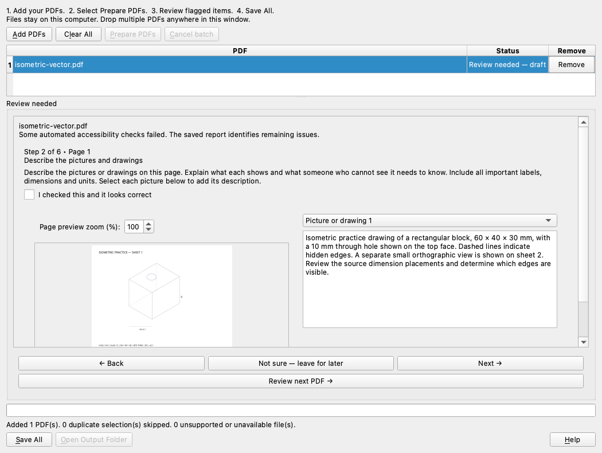

# 📚 PDF Accessibility Prep

**Big stack of PDFs? Let's make it manageable.**

**Created and maintained by Eathan Huber · [g4l4xy](https://github.com/g4l4xy)**

Copyright © 2026 Eathan Huber. See [authorship and attribution](AUTHORS.md).

A portable Windows app that prepares PDFs in batches, keeps your documents on your computer, and walks you through the checks that need a human eye. Built for classroom handouts, scanned worksheets, reports, and design-and-drafting drawings—including isometric views.

**[🛠️ Build the Windows app](#-build-it-yourself)** · **[Quick start](#-four-steps-one-window)** · **[What it can do](docs/COVERAGE.md)** · **[License](LICENSE)**

> **Preparation is a starting point.** A successful upload or automated check is not an accessibility certification. Unresolved items stay clearly marked as drafts.

## ✨ Four steps. One window.

1. **Add PDFs** — select several files at once or drop them into the window.
2. **Prepare PDFs** — let the app work through the queue. Each PDF stays separate.
3. **Review** — answer one plain-language question at a time. Not sure? Leave it for later.
4. **Save All** — choose a folder once. Get a prepared PDF and an individual accessibility report for each successful file.

No account to create. No API key to find. No document upload to a server.

## 🧭 Review without getting lost



*Layout preview from the actual application's macOS offscreen rendering; the packaged application is for Windows.*

- A step counter tells you where you are.
- **Back** and **Next** stay visible.
- Picture descriptions sit beside the page preview.
- **Not sure — leave for later** lets you continue without pretending something passed.
- Your answers stay in the session when you move between PDFs.
- **Finish review** saves your answers and rechecks the PDF.
- Technical controls are available under **More editing tools (optional)**.

Clicking Next never checks an item for you. Save All catches review changes that still need to be finished.

## 🛠️ What's in the toolbox?

| Feature | What it means for you |
|---|---|
| Real batch processing | Add more files before starting; remove one or clear the queue. |
| Duplicate detection | Repeated selections and identical copies are caught. Different documents with the same name stay separate. |
| Local English OCR | Add searchable text to supported scans while keeping their original artwork. |
| Drawing support | Preserve vector paths, line styles, page scale, nested CAD artwork, and supported layers. Add the explanation a learner needs. |
| Preservation checks | Compare page counts, ordered pages, page boxes, rotation, text, vectors, and rendered appearance. Reject detected changes. |
| Independent validation | Run bundled veraPDF PDF/UA-1 checks and show the actual result. |
| Failure isolation | One damaged file does not stop the other PDFs. |
| Cancel and continue | Cancel a batch while keeping completed results available to save. |
| Safe filenames | Save `Worksheet_prepared.pdf`; use numbered alternatives when a name already exists. Originals are not overwritten. |

### 📐 Drafting class? Bring the isometric views.

Describe the object, view direction, dimensions and units, holes, hidden edges, tolerances, and the purpose of the exercise. The app preserves the drawing; it does not invent its meaning or its measurements. Some source structures, technical notation, and spatial tasks need an instructor or accessibility specialist. [Drawing details →](docs/DRAWINGS.md)

## 🚀 Get started on Windows

This initial public repository provides the application source and Windows build instructions. A prebuilt executable is not attached to this repository yet. Use the [build instructions below](#-build-it-yourself) to create the portable Windows executable.

Once built, run `dist/PDF-Accessibility-Prep.exe`, add a small set of PDFs, and follow the four steps above. The portable build includes its PDF, OCR, Java, and validation components; normal use needs no separate developer runtime.

Keep the original documents and review the output before sharing it. The first extraction and the bundled components make this a larger download than a typical single-purpose utility.

## 🎓 Brightspace-friendly PDFs

D2L documents PDF as a supported course-content format. Each output receives local format checks for a readable PDF, pages, syntax warnings, `.pdf` extension, and absence of password encryption. File size is recorded. Course quotas, assignment restrictions, and permissions can still differ.

**No live institutional Brightspace upload is claimed.** See [the compatibility notes and official D2L references](docs/BRIGHTSPACE.md).

## 🔎 Honest about the checks

- Required mixed batches of **1, 10, 50, and 100 PDFs** passed in the drawing-build regression run.
- The final guided-review update passed **5 targeted Windows tests** and **11 packaged executable checks**.
- Windows testing used **Windows 11 ARM64 in Parallels, running the x64 build under emulation**.
- Earlier offline checks passed for the drawing build. Manual native Windows interaction, screen-reader acceptance, and pristine native-x64 testing are separate checks.

[Read the public test record →](docs/TESTING.md)

## 🧑‍💻 Build it yourself

Use Python **3.13.15 x64** on Windows, then run from the repository root:

```powershell
powershell -ExecutionPolicy Bypass -File scripts/build.ps1
```

The script installs pinned build dependencies, downloads and verifies bundled resources, runs tests, packages the executable, and exercises frozen worker processes. Build-time internet access is needed unless dependencies are cached. Output: `dist/PDF-Accessibility-Prep.exe`.

For development, install `requirements-dev.txt`, supply the documented local resources, and run `python main.py`. See [developer notes](docs/DEVELOPER.md). The **Windows portable build** GitHub Actions workflow can be run manually; do not assume it passed unless its run says so.

## 🤝 Help make the next PDF easier

Found a bug or an unclear review step? [Open an issue](https://github.com/g4l4xy/pdf-accessibility-prep/issues/new/choose) with what happened, what you expected, and your Windows version. Please use a small synthetic or fully redacted example—never upload student records, confidential coursework, passwords, or private documents.

See [CONTRIBUTING.md](CONTRIBUTING.md) and [SECURITY.md](SECURITY.md).

## ⚖️ Open source, with clear responsibilities

This project is licensed under **GNU AGPL-3.0-or-later**. Commercial use, modification, and redistribution are allowed when the applicable license conditions are met; separate written approval is **not** required for rights already granted by the AGPL.

The software is provided **as is, without warranty, to the extent permitted by law**. You remain responsible for backups, reviewing results, and deciding whether a document is suitable for its intended use. No accessibility, legal-compliance, or publication guarantee is made.

The license does not grant permission to imply official endorsement or misuse project branding. Separate written permission is required before claiming a distribution, service, or product is officially sponsored or approved by the maintainers.

Read the [Terms and Conditions](TERMS.md), [License](LICENSE), [Third-party Notices](THIRD-PARTY-NOTICES.md), and [dependency source access instructions](THIRD-PARTY-SOURCES.md).

---

**A little help with the PDF pile. A clear place for human judgment.**
