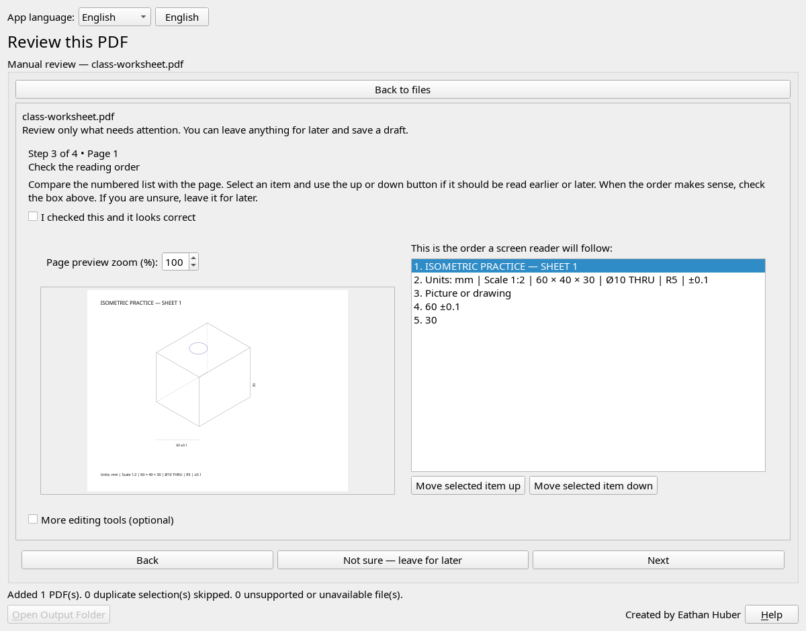
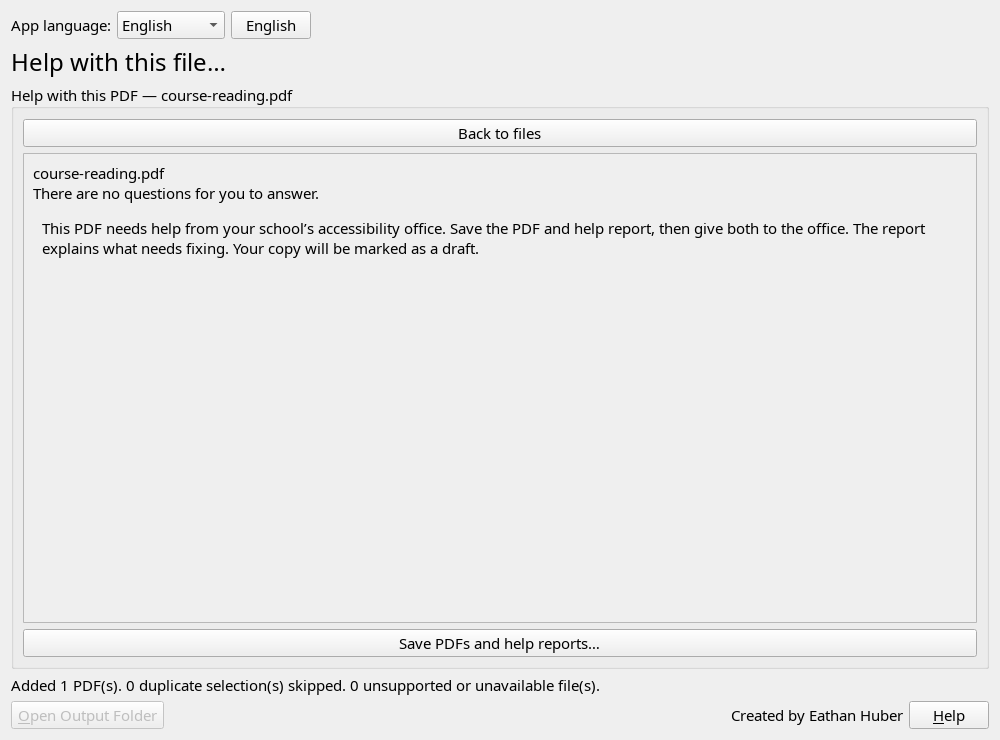

# Automatic preparation and optional manual review

Version 0.2.0 puts the routine path first: **Add PDFs → Prepare PDFs → Save prepared PDFs…**. The final button shows the number of available PDFs; it opens one folder picker and saves separate PDF/report pairs. It does not download files from a server. Originals are preserved and matching output names receive a suffix.

## What happens automatically

The app performs supported metadata, text recognition, tagging, preservation, and independent validation work for each file. An existing tagged PDF that passes the checks can be saved without completing a generic human checklist. Titles and existing language tags are retained; missing titles use recognizable filenames and missing language uses the language selected in the main window.

General title/language confirmation and visual-accessibility advice remain available through **Manual review…**. These optional suggestions are not treated as failures, and the software does not invent human-review confirmations. A conservative uniform-text layout check distinguishes simple newly tagged text from ambiguous layouts; it does not claim to understand all semantics.

## If automatic preparation cannot finish everything

The batch continues through the other PDFs. Afterward, one in-window message explains the remaining problems and asks whether to review now. **Not now — keep drafts** dismisses it; selecting a file, refreshing the list, or saving does not ask again. Newly prepared files can produce a new notice on their next batch.

Missing picture descriptions, uncertain OCR, complex reading order, unsupported source structures, missing fonts, and failed or unavailable validation remain explicit. Existing described/tagged graphics do not require a new description merely because the page contains vector paths. A page with a picture does not automatically receive an OCR-accuracy question if no recognized text was added.

**Review now** presents required items only. **Manual review…** also makes optional checks available. Review uses the main window space and has a clear **Back to files** button. Saved answers are revalidated. Unapplied answers are retained when leaving the review and must be finished before saving; a report-only review change is offered for saving even when PDF bytes are unchanged.

## What a pass means

“Automatic checks passed” is a machine-check result, not a certification of WCAG compliance, the correctness of a drawing, or publication readiness. Failed or unavailable validation cannot be dismissed with a checkbox. PDF/UA-1 identification is added automatically before independent validation; metadata alone cannot turn a failed or incomplete result into a pass. Drafts remain labeled in the queue and individual reports.

## Version 0.3.1: fewer technical tasks for instructors

The app now makes two supported export defaults explicit automatically: the identity glyph mapping for an embedded TrueType CID font using Identity encoding, and a missing name for a drawing-layer configuration. It does not substitute fonts, change an existing glyph map, or change layer visibility. Every prepared result still undergoes page, text, geometry, and rendered-appearance comparisons. The identity default is documented in [Adobe’s PDF Reference, version 1.5](https://opensource.adobe.com/dc-acrobat-sdk-docs/pdfstandards/pdfreference1.5_v6.pdf), in the CIDFont dictionary description.

Drawing review asks what a student should learn and provides a description box beside a larger page preview. Reading-order review shows the actual numbered content items beside the page, with **Move selected item up/down** buttons; instructors no longer have to open the advanced tag table for basic reordering. Unfinished answers remain available when leaving review or changing interface language.

Technical failures are not review questions. Review contains only questions a user can answer. When there are none, the app skips numbered steps, hides advanced editing and navigation controls, and offers **Save PDFs and help reports…** with a concrete next step. Missing Figure descriptions are no longer misreported as a separate generic structure error. PDF/UA-1 identification is added automatically during preparation and refreshed after edits. The final PDF is independently validated; unresolved issues remain drafts.

Meaningful image descriptions and ambiguous reading order still require informed human input. The app does not invent geometry, dimensions, or learning objectives, and does not treat pressing Next as confirmation.

Windows Qt views with synthetic classroom documents.
